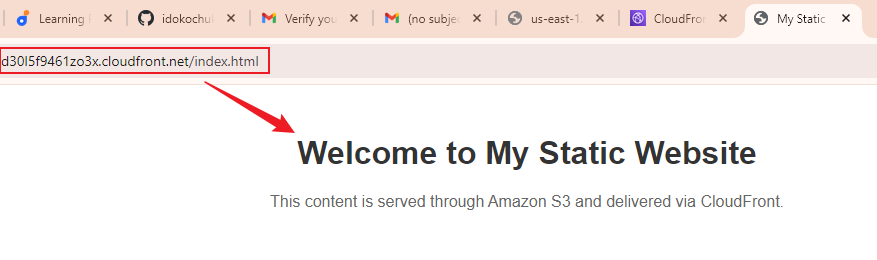

# Mini Project: S3 Bucket Policy for CloudFront Access

### Purpose:

The goal of this mini project is to configure an S3 bucket policy to restrict access exclusively to a specific CloudFront distribution. This will ensure that the S3 content is securely delivered through CloudFront, preventing direct access to the S3 bucket.

### Objectives:
1. Create an S3 Bucket
2. Configure Static Website Hosting
3. Create a CloudFront Distribution
4. Set Up S3 Bucket Policy
5. Verify Access Restrictions: Ensure that direct access to the S3 bucket is blocked, and content is accessible only through CloudFront.

### Tools Used and Their Applications:

- **Gitbash:** Used to clone my repository, manage version control, and commit changes to GitHub.

- **GitHub:** Stores and shares the project's documentation.

- **Visual Studio Code:** Used for documentation in markdown. Its integrated terminal allows for executing Git commands.

- **Markdown:** Used for writing project documentation, including the objectives, steps, and explanations of the project.

- **Snipaste:** Used to capture screenshots of the AWS management console during the setup process. These screenshots are included in the documentation to provide visual aids, making it easier to follow the steps and understand the configuration process.

The project will follow a structured workflow to ensure the efficient configuration of the S3 bucket policy and CloudFront distribution, restricting access exclusively to a specific CloudFront distribution. The process begins with creating a GitHub repository to manage the project files, followed by cloning the repository to the local machine for development. After configuring the S3 bucket policy and CloudFront distribution, updates are committed and pushed to GitHub.

## Project Flow
**Task 1: Create an S3 Bucket**

- Click on "Create bucket".
- Enter a unique bucket name.

- Configure other settings as needed
1. All Public access blocked

2. Click on Create bucket

3. Bucket successfully created

4. Upload object `index.html` file

**Task 2: Configure Static Website Hosting**
- Navigate to your S3 bucket and click on its name.
- Go to the Properties tab.

- Scroll down to the Static website hosting section and click on "Edit".

- Select `Enable` and configure the following:
- Index document: `index.html`

- Click on "Save changes".

**Task 3: Create a CloudFront Distribution**

- Navigate to the CloudFront service in the AWS Management Console.
- Click on "Create Distribution".

Configure the distribution settings:

- Origin Domain Name: Select your S3 bucket from the list or enter the bucket's website endpoint.

- Viewer Protocol Policy: Set it to "Redirect HTTP to HTTPS" or "HTTPS Only" for better security.
- Allowed HTTP Methods: Leave it as the default "GET, HEAD".
- Cache Policy: Use the default cache policy or configure as needed.

- Web Application Firewall (WAF): Do not enable security protections

- Scroll down and click on "Create Distribution".

- Wait for the distribution to be deployed

- Successfully deployed

**Task 4: Configure S3 Bucket Policy**

- Navigate back to your S3 bucket in the AWS Management Console.
- Go to the Permissions tab.

- Click on "Edit"

- Write policy, replacing `YOUR-DISTRIBUTION-ID` with your `CloudFront distribution ID` and `YOUR-BUCKET-NAME` with `your bucket name:`

- Save the policy.

**Task 5: Verify Access**

Test Direct Access:
- Navigate to my bucket, click on the `Bucket name`, and then click on the object `index.html.`

- Click on the object URL, or copy the URL, paste it into the browser address bar, and press the enter key.

- I should receive an "Access Denied" error.

Test CloudFront Access:

Access the same object via the CloudFront distribution URL (e.g., http://YOUR-DISTRIBUTION-ID.cloudfront.net/index.html).

ERROR - The content was not delivered

At this point, verification access was denied when tested via both `Direct Access` and `CloudFront Access`. To further troubleshoot and solve the problem, I followed the process outlined below.

**ATTEMPT SOLUTION ONE (1):** Adjusted CloudFront settings and S3 bucket public access permissions

- Navigate to my CloudFront Distribution and click `edit`.

- Scroll down to the Default Root Object section and enter `index.html`.
- Click `Save changes`

Next, I navigated to my bucket settings to disable the "Block all public access" option.

STEP ONE - Access the bucket, click on the `Permissions` tab, and then click on `Edit`.

STEP TWO - Uncheck the `Block all public access` option, then click on `Save changes.`

STEP THREE - Confirm the changes

Access the index.html file directly through the S3 website endpoint URL and also via the CloudFront distribution URL to verify if both methods are working correctly.

**Use the same method as described in Task 5 above.**
- This did not resolve the issue. I still received an "Access Denied" message for both access methods.

**ATTEMPT SOLUTION TWO (2):** My next attempt to resolve the issue is to Configured CloudFront with an Origin Access Identity (OAI) and invalidated the CloudFront cache.

Here's a detailed step-by-step approach I used to configure my CloudFront distribution with an OAI and restrict access to my S3 bucket:
- Access the CloudFront Console and select my Distribution ID.

- Navigate to the Origins and select S3 bucket origin.
- Click `Edit`.

#### Configure OAI
- In the `Edit Origin` settings, under `Settings`," select `Amazon S3` from the list of AWS origins.

- In the `Origin Access` section, choose `Legacy access identities (OAI).` Then, select my Origin access identity and check `Yes, update the bucket policy.` (This will automatically update the bucket policy of my S3 bucket.)

- Save your changes.

**Invalidate CloudFront Cache:** This is necessary to ensure that users receive the most current content from my S3 bucket server.
- Go to the CloudFront Console.
- Select my Distribution.

- Navigate to the "Invalidations" Tab.
- Create Invalidation:

- Enter /* to invalidate all objects.
- Click "Invalidate".

### Verification
1.  **Test Direct S3 Access:** Try accessing my index.html file directly via the S3 `Object URL`.

- Click on the URL link or copy and paste it into your browser’s address bar and press Enter.

    It returned an `access denied` message, indicating that the configuration is set up to prevent direct access to the S3 bucket.

2. **Test CloudFront Access:** Use the CloudFront URL to access the index.html file: http://YOUR-DISTRIBUTION-ID.cloudfront.net/index.html.

This successfully restricted access to CloudFront and confirmed the S3 bucket was secure.

### Summary
The mini project focused on configuring an S3 bucket policy to restrict access exclusively through a CloudFront distribution, ensuring secure delivery of content via CloudFront while preventing direct access to the S3 bucket.

### Steps Completed:

- S3 Bucket Creation: Successfully created an S3 bucket and enabled static website hosting.
- CloudFront Distribution: Set up a CloudFront distribution to serve content from the S3 bucket.
- S3 Bucket Policy Configuration: Applied a policy to restrict direct access and permit only CloudFront access.
- Verification: Tested access methods to confirm that direct S3 access was denied and CloudFront access was functional.

### Challenges Encountered:

1. Initially, access was denied through both direct S3 and CloudFront URLs.
2. Implemented two solutions:
- **Solution One:** Adjusted CloudFront settings and S3 bucket public access permissions, but this did not resolve the issue.
- **Solution Two:** Configured CloudFront with an Origin Access Identity (OAI) and invalidated the CloudFront cache. This successfully restricted access to CloudFront and confirmed the S3 bucket was secure.

The project demonstrated effective configuration of S3 and CloudFront for secure content delivery, with final verification ensuring correct setup and access control.